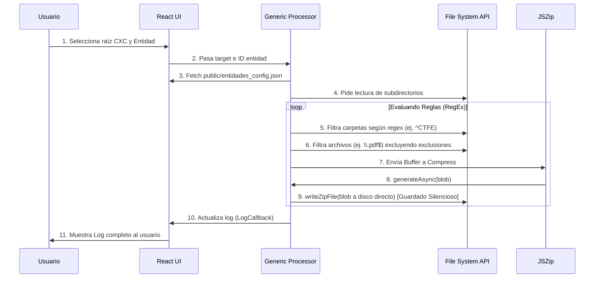
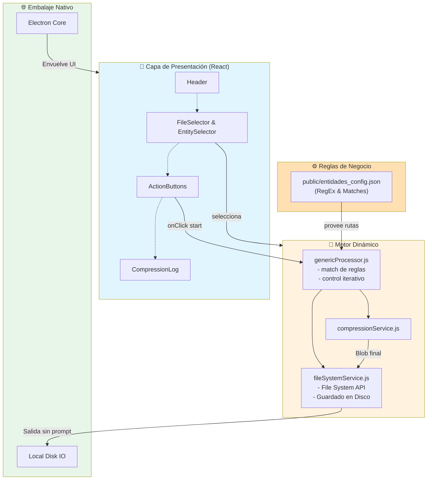

# 📐 Arquitectura del Sistema - Comprimir Archivos

## 📋 Descripción General del Proyecto

**Aplicación Web para Compresión de Archivos**

Una herramienta web moderna que permite a los usuarios seleccionar múltiples archivos o carpetas completas y comprimirlos en un archivo ZIP descargable. La aplicación está diseñada para ser rápida, intuitiva y funcionar completamente en el navegador sin necesidad de servidor.

---

## 🎯 Requisitos Funcionales

### MVP (Versión Actual)

- ✅ Selección de múltiples archivos
- ✅ Selección de carpetas completas
- ✅ Compresión en tiempo real
- ✅ Descarga de archivo ZIP
- ✅ Interfaz intuitiva y responsiva
- ✅ Log de archivos comprimidos
- ✅ Limpieza de selección

### Funciones Futuras (Roadmap)

- 🔲 Edición de archivos dentro del ZIP
- 🔲 Compresión con contraseña
- 🔲 Historial de compresiones (Local Storage)
- 🔲 Soporte para otros formatos (.tar.gz, .7z, .rar)
- 🔲 Arrastrar y soltar archivos (Drag & Drop)
- 🔲 Barra de progreso en tiempo real
- 🔲 Estadísticas de compresión
- 🔲 Previsualización de contenido del ZIP

---

## 🏗️ Arquitectura General

```
┌─────────────────────────────────────────────────────────────┐
│                        CAPA PRESENTACIÓN                      │
│                    (React Components)                         │
│  ┌──────────────┐  ┌─────────────┐  ┌─────────────────┐    │
│  │  App.js      │  │ FileSelector │  │ CompressionLog  │    │
│  │ (Principal)  │  │  (Inputs)    │  │  (Resultado)    │    │
│  └──────────────┘  └─────────────┘  └─────────────────┘    │
└────────────────────────┬────────────────────────────────────┘
                         │
┌────────────────────────┴────────────────────────────────────┐
│                    CAPA DE LÓGICA                            │
│         (Servicios y Utilidades de Compresión)              │
│  ┌────────────────────────────────────────────────────┐    │
│  │ genericProcessor.js (Motor Dinámico)                │    │
│  │ - applyRules(config)                                │    │
│  │ compressionService.js (Gestión de ZIP)              │    │
│  │ - crearZip()                                        │    │
│  │ fileSystemService.js (Gestión Local de Archivos)    │    │
│  │ - writeZipFile()                                    │    │
│  └────────────────────────────────────────────────────┘    │
└────────────────────────┬────────────────────────────────────┘
                         │
┌────────────────────────┴────────────────────────────────────┐
│                   CAPA DE ESTADO                             │
│                    (React Hooks)                             │
│  - useEntityProcessing (Reglas)                              │
│  - useFileSelection (Interfaces)                             │
└────────────────────────┬────────────────────────────────────┘
                         │
┌────────────────────────┴────────────────────────────────────┐
│                  RUNTIME Y LIBRERÍAS EXTERNAS                │
│  - Electron (Escritorio Empaquetado)                         │
│  - File System Access API (Escritura Silenciosa en Disco)    │
│  - JSZip (Compresión)                                        │
│  - React (UI Framework)                                      │
└─────────────────────────────────────────────────────────────┘
```

---

## 💻 Stack Tecnológico Detallado

### **Frontend & Motor**

| Capa           | Tecnología    | Versión | Propósito                       |
| -------------- | ------------- | ------- | ------------------------------- |
| **Framework**  | React         | 18.2.0  | Interfaz de usuario reactiva    |
| **App Nivel**  | Electron      | 29.1.5  | Contenedor nativo de escritorio |
| **Archivos**   | File System API| Local  | Lectura/Escritura directa a OS  |
| **Compresión** | JSZip         | 3.10.1  | Crear archivos ZIP en navegador |
| **Styling**    | CSS Modules   | -       | Estilos locales aislados        |

### **Deployment**

| Componente  | Opción                          | Notas                       |
| ----------- | ------------------------------- | --------------------------- |
| **Empaque** | Electron Builder                | Genera el archivo .exe final|
| **Ambiente**| Aplicación de Escritorio        | Funciona sin conexión local |
| **Config**  | JSON Externa                    | Actualizable sin re-build   |

### **Ambiente de Desarrollo**

```json
{
  "Node.js": "16.x o superior",
  "npm": "8.x o superior",
  "Empaquetado": "npx electron-builder",
  "OS Objetivo": "Windows (Portable & Program Files)"
}
```

---

## 📁 Estructura de Carpetas Recomendada (Actualizada)

```
comprimir-archivos/
├── public/                        # Activos públicos
│   ├── entidades_config.json      # REGLAS DE NEGOCIO DINÁMICAS (JSON)
│   ├── electron.js               # Punto de entrada de Electron
│   ├── preload.js                # Puente opcional Electron-React
│   └── index.html                # HTML principal
├── src/                           # Código fuente
│   ├── components/               # UI aislada (CSS Modules)
│   ├── services/                 # Servicios 
│   │   ├── genericProcessor.js    # Lógica de reglas JSON a RegEx
│   │   ├── fileSystemService.js   # Manejo avanzado de disco directo
│   │   ├── compressionService.js  # Lógica de compresión ZIP
│   │   └── entityProcessors/      # Archivos Legacy removibles
│   ├── hooks/                     # Custom Hooks (useEntityProcessing)
│   ├── utils/                     # Constantes de la app
│   └── index.js                   # Ejecutor web
├── dist/                          # Compilación de Ejecutables (.exe)
├── package.json                   # Dependencias npm y comandos
├── DOCUMENTACION.md               # Manual Técnico y Usuarios
└── ARQUITECTURA.md                # Este archivo

```

---

## 🔄 Flujo de Datos Dinámico (File System Access)



---

## 🔐 Consideraciones de Seguridad

### Implementadas ✅

- **Compresión Local en Memoria:** Electron + Chrome sin envíos externos.
- **Acceso Exclusivo FS API:** Sin *Node Integration*, mantiene sandboxed la lectura.
- **Protección de Datos OS:** Bloquea inyección al no usar servidor Node, la manipulación es de buffers locales en RAM.

---

## 📊 Diagrama de Arquitectura Completa



---

## 🚀 Flujo de Desarrollo

### Fase 1: Estructura Básica (Actual)

```
✅ Componente App.js monolítico
✅ Lógica de compresión integrada
✅ Interfaz funcional
```

### Fase 2: Refactorización (Recomendada)

```
→ Dividir en componentes reutilizables
→ Extraer servicios de lógica
→ Agregar custom hooks
→ Mejorar estilos con CSS modules
```

### Fase 3: Mejoras (Futuro)

```
→ Agregar tests unitarios
→ Drag & Drop
→ Progreso visual
→ Soporte PWA (offline)
→ Historial con LocalStorage
```

### Fase 4: Escalabilidad (Opcional)

```
→ TypeScript para type-safety
→ Redux/Context API para estado complejo
→ Lazy loading de componentes
→ Code splitting
```

---

## 📈 Consideraciones de Escalabilidad

### Límites del Navegador

| Factor                       | Límite                  | Recomendación                     |
| ---------------------------- | ----------------------- | --------------------------------- |
| **Tamaño total de archivos** | 500MB - 2GB\*           | Validar y alertar al usuario      |
| **Número de archivos**       | 10,000+                 | Mostrar indicador de progreso     |
| **Memoria disponible**       | Depende del dispositivo | Implementar compresión por chunks |

\*Varía según navegador y disponibilidad de RAM

### Optimización de Rendimiento

```javascript
// ✅ Implementar procesamiento en Web Workers
// ✅ Usar useCallback para evitar re-renders
// ✅ Lazy load JSZip si no se usa inmediatamente
// ✅ Implementar Virtual Scrolling para listas grandes
// ✅ Optimizar imágenes del logo
```

---

## 🧪 Estrategia de Testing

```
src/
├── __tests__/
│   ├── compressionService.test.js
│   ├── fileService.test.js
│   └── downloadService.test.js
├── components/
│   ├── FileSelector/
│   │   └── FileSelector.test.js
│   └── CompressionLog/
│       └── CompressionLog.test.js
```

### Cobertura Objetivo

- Servicios: 90%+
- Componentes: 80%+
- Hooks custom: 85%+

---

## 📱 Responsividad

### Breakpoints

```css
Mobile: 320px - 480px (phones)
Tablet: 481px - 768px (tablets)
Desktop: 769px - 1920px (desktops)
Ultra-wide: 1921px+ (monitors)
```

---

## 🌐 Deployment

### Opciones Recomendadas

#### 1. **Vercel** (Recomendado)

```bash
# Ventajas: Gratis, rápido, uno-click deployment
npm install -g vercel
vercel
```

#### 2. **Netlify**

```bash
# Ventajas: Gratis, buena integración con Git
npm install -g netlify-cli
netlify deploy
```

#### 3. **GitHub Pages**

```bash
# Ventajas: Gratis para públicos, integrado con Git
npm run build
```

---

## 📝 Variables de Entorno

Crear `.env` en la raíz:

```bash
# .env
REACT_APP_VERSION=1.0.0
REACT_APP_ENVIRONMENT=production
REACT_APP_API_URL=https://api.tudominio.com
REACT_APP_COMPRESSION_LIMIT=500MB
```

---

## 🔄 CI/CD Pipeline (Futuro)

```yaml
name: Deploy
on: [push]
jobs:
  build:
    runs-on: ubuntu-latest
    steps:
      - uses: actions/checkout@v2
      - uses: actions/setup-node@v2
      - run: npm install
      - run: npm test
      - run: npm run build
      - run: npx vercel --prod
```

---

## 📚 Documentación Adicional

- **README.md**: Guía de usuario y setup
- **CONTRIBUTING.md**: Guía para contribuidores
- **CHANGELOG.md**: Historial de versiones
- **API.md**: Documentación de servicios (cuando exista backend)

---

## 🎓 Dependencias de Proyecto

```json
{
  "dependencies": {
    "react": "^18.2.0",
    "react-dom": "^18.2.0",
    "react-scripts": "5.0.1",
    "jszip": "^3.10.1",
    "web-vitals": "^5.1.0"
  },
  "devDependencies": {
    "cross-zip": "^4.0.1",
    "@testing-library/react": "^12.1.5",
    "@testing-library/jest-dom": "^5.16.4",
    "@testing-library/user-event": "^13.5.0",
    "eslint": "^8.0.0",
    "prettier": "^2.8.0"
  }
}
```

---

## 🎯 Checklist de Implementación

### MVP (Completado)

- [x] Selección de archivos
- [x] Selección de carpetas
- [x] Compresión con JSZip
- [x] Descarga de ZIP
- [x] Log de operaciones
- [x] Interfaz responsiva

### Siguiente Fase

- [ ] Dividir en componentes
- [ ] Extraer servicios
- [ ] Agregar tests
- [ ] Mejorar styling con CSS modules
- [ ] Documentación de API
- [ ] GitHub Actions CI/CD

---

**Última actualización:** 31 de marzo de 2026  
**Estado:** Arquitectura v1.0 - Completada  
**Responsable:** Equipo de Desarrollo
