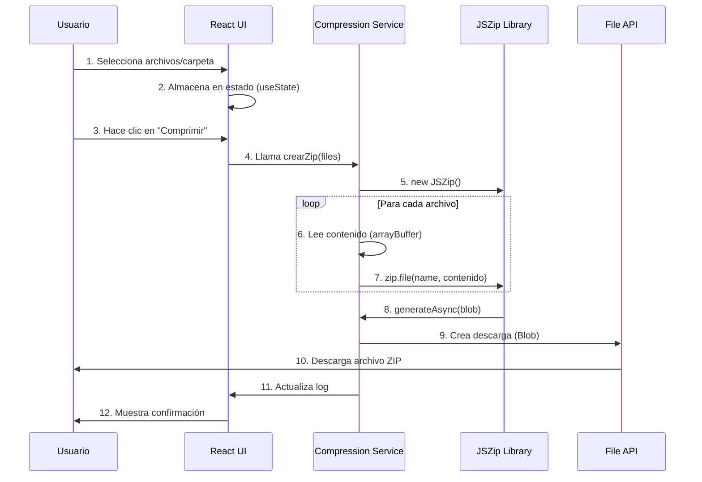
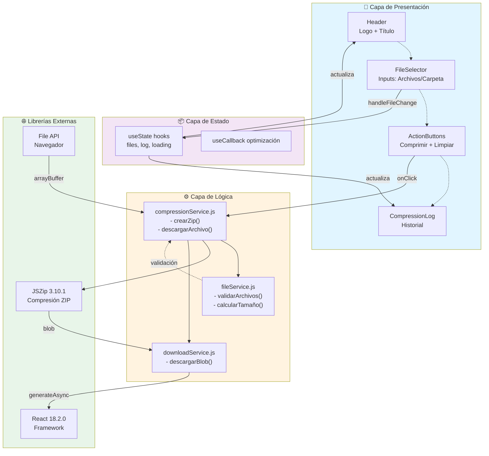

# 📐 Arquitectura del Sistema - Comprimir Archivos

## 📋 Descripción General del Proyecto

**Aplicación Web para Compresión de Archivos**

Una herramienta web moderna que permite a los usuarios seleccionar múltiples archivos o carpetas completas y comprimirlos en un archivo ZIP descargable. La aplicación está diseñada para ser rápida, intuitiva y funcionar completamente en el navegador sin necesidad de servidor.

---

## 🎯 Requisitos Funcionales

### MVP (Versión Actual)

- ✅ Selección de múltiples archivos
- ✅ Selección de carpetas completas
- ✅ Compresión en tiempo real
- ✅ Descarga de archivo ZIP
- ✅ Interfaz intuitiva y responsiva
- ✅ Log de archivos comprimidos
- ✅ Limpieza de selección

### Funciones Futuras (Roadmap)

- 🔲 Edición de archivos dentro del ZIP
- 🔲 Compresión con contraseña
- 🔲 Historial de compresiones (Local Storage)
- 🔲 Soporte para otros formatos (.tar.gz, .7z, .rar)
- 🔲 Arrastrar y soltar archivos (Drag & Drop)
- 🔲 Barra de progreso en tiempo real
- 🔲 Estadísticas de compresión
- 🔲 Previsualización de contenido del ZIP

---

## 🏗️ Arquitectura General

```
┌─────────────────────────────────────────────────────────────┐
│                        CAPA PRESENTACIÓN                      │
│                    (React Components)                         │
│  ┌──────────────┐  ┌─────────────┐  ┌─────────────────┐    │
│  │  App.js      │  │ FileSelector │  │ CompressionLog  │    │
│  │ (Principal)  │  │  (Inputs)    │  │  (Resultado)    │    │
│  └──────────────┘  └─────────────┘  └─────────────────┘    │
└────────────────────────┬────────────────────────────────────┘
                         │
┌────────────────────────┴────────────────────────────────────┐
│                    CAPA DE LÓGICA                            │
│         (Servicios y Utilidades de Compresión)              │
│  ┌────────────────────────────────────────────────────┐    │
│  │ compressionService.js (Gestión de ZIP)              │    │
│  │ - crearZip()                                        │    │
│  │ - descargarArchivo()                                │    │
│  │ - generarLog()                                      │    │
│  └────────────────────────────────────────────────────┘    │
└────────────────────────┬────────────────────────────────────┘
                         │
┌────────────────────────┴────────────────────────────────────┐
│                   CAPA DE ESTADO                             │
│                    (React Hooks)                             │
│  - useState (archivos, log)                                  │
│  - useEffect (inicialización)                                │
│  - useCallback (optimización)                                │
└────────────────────────┬────────────────────────────────────┘
                         │
┌────────────────────────┴────────────────────────────────────┐
│                  LIBRERÍAS EXTERNAS                          │
│  - JSZip (Compresión)                                        │
│  - React (UI Framework)                                      │
│  - File API (Navigador)                                      │
└─────────────────────────────────────────────────────────────┘
```

---

## 💻 Stack Tecnológico Detallado

### **Frontend**

| Capa           | Tecnología    | Versión | Propósito                       |
| -------------- | ------------- | ------- | ------------------------------- |
| **Framework**  | React         | 18.2.0  | Interfaz de usuario reactiva    |
| **Compresión** | JSZip         | 3.10.1  | Crear archivos ZIP en navegador |
| **Build Tool** | React Scripts | 5.0.1   | Bundler y dev server            |
| **Styling**    | CSS3          | -       | Estilos personalizados          |
| **Runtime**    | Node.js       | 14+     | Entorno de desarrollo           |

### **Deployment**

| Componente  | Opción                          | Notas                       |
| ----------- | ------------------------------- | --------------------------- |
| **Hosting** | Vercel / Netlify / GitHub Pages | SPA estática, sin servidor  |
| **CDN**     | Automático (incluido)           | Distribución global         |
| **SSL/TLS** | Automático                      | Certificado Let's Encrypt   |
| **Dominio** | Personalizado recomendado       | ej: comprimir.tudominio.com |

### **Ambiente de Desarrollo**

```json
{
  "Node.js": "16.x o superior",
  "npm": "8.x o superior",
  "Git": "Para control de versiones",
  "VS Code": "Editor recomendado",
  "Navegadores soportados": "Chrome 90+, Firefox 88+, Safari 14+, Edge 90+"
}
```

---

## 📁 Estructura de Carpetas Recomendada

```
comprimir-archivos/
├── .git/                          # Control de versiones
├── .gitignore                     # Archivos a ignorar en Git
├── node_modules/                  # Dependencias (generado)
├── public/                        # Activos públicos
│   ├── index.html                # HTML principal
│   ├── favicon.ico                # Icono de pestaña
│   ├── manifest.json             # Configuración PWA
│   ├── robots.txt                # SEO
│   └── logo-clinica.png          # Logo de la aplicación
├── src/                           # Código fuente
│   ├── components/               # Componentes reutilizables
│   │   ├── FileSelector/        # Selector de archivos
│   │   │   ├── FileSelector.js
│   │   │   ├── FileSelector.css
│   │   │   └── FileSelector.test.js
│   │   ├── CompressionLog/      # Log de compresión
│   │   │   ├── CompressionLog.js
│   │   │   ├── CompressionLog.css
│   │   │   └── CompressionLog.test.js
│   │   ├── Header/              # Encabezado
│   │   │   ├── Header.js
│   │   │   ├── Header.css
│   │   │   └── Header.test.js
│   │   └── ActionButtons/       # Botones de acción
│   │       ├── ActionButtons.js
│   │       ├── ActionButtons.css
│   │       └── ActionButtons.test.js
│   ├── services/                 # Servicios y utilidades
│   │   ├── compressionService.js  # Lógica de compresión
│   │   ├── fileService.js         # Manejo de archivos
│   │   └── downloadService.js     # Descargas
│   ├── hooks/                     # Custom Hooks
│   │   ├── useFileSelection.js    # Hook para selección
│   │   └── useCompression.js      # Hook para compresión
│   ├── utils/                     # Utilidades generales
│   │   ├── validators.js          # Validadores
│   │   ├── formatters.js          # Formateadores
│   │   └── constants.js           # Constantes de la app
│   ├── styles/                    # Estilos globales
│   │   ├── App.css               # Estilos principales
│   │   ├── index.css             # Estilos globales
│   │   └── variables.css         # Variables y temas
│   ├── App.js                     # Componente principal
│   ├── App.css                    # Estilos de App
│   ├── App.test.js               # Tests de App
│   ├── index.js                   # Punto de entrada
│   ├── index.css                  # Estilos de index
│   ├── reportWebVitals.js        # Métricas de rendimiento
│   └── setupTests.js             # Configuración de tests
├── build/                         # Compilación final (generado)
│   ├── index.html
│   ├── static/
│   │   ├── css/
│   │   └── js/
│   └── ...
├── .env                           # Variables de entorno (local)
├── .env.example                   # Ejemplo de variables
├── .browserlistrc                 # Navegadores soportados
├── .eslintrc                      # Configuración ESLint
├── .prettierrc                    # Configuración Prettier
├── package.json                   # Dependencias de npm
├── package-lock.json             # Lock file
├── zip-build.js                   # Script de compilación
├── README.md                      # Documentación
├── ARQUITECTURA.md               # Este archivo
│── CHANGELOG.md                  # Historial de cambios
├── CONTRIBUTING.md               # Guía de contribución
└── LICENSE                        # Licencia MIT

```

---

## 🔄 Flujo de Datos



---

## 🔐 Consideraciones de Seguridad

### Implementadas ✅

- Compresión en navegador (sin servidor)
- Sin almacenamiento de datos del usuario
- Sin envío de archivos a servidor
- Sin cookies ni tracking
- HTTPS obligatorio en producción

### Recomendaciones Futuras 🔲

- Validación de tipos MIME
- Límites de tamaño de archivo
- Scanning de malware (VirusTotal API)
- Compresión con contraseña (cifrado)
- Content Security Policy (CSP)
- Política de privacidad clara

---

## 📊 Diagrama de Arquitectura Completa



---

## 🚀 Flujo de Desarrollo

### Fase 1: Estructura Básica (Actual)

```
✅ Componente App.js monolítico
✅ Lógica de compresión integrada
✅ Interfaz funcional
```

### Fase 2: Refactorización (Recomendada)

```
→ Dividir en componentes reutilizables
→ Extraer servicios de lógica
→ Agregar custom hooks
→ Mejorar estilos con CSS modules
```

### Fase 3: Mejoras (Futuro)

```
→ Agregar tests unitarios
→ Drag & Drop
→ Progreso visual
→ Soporte PWA (offline)
→ Historial con LocalStorage
```

### Fase 4: Escalabilidad (Opcional)

```
→ TypeScript para type-safety
→ Redux/Context API para estado complejo
→ Lazy loading de componentes
→ Code splitting
```

---

## 📈 Consideraciones de Escalabilidad

### Límites del Navegador

| Factor                       | Límite                  | Recomendación                     |
| ---------------------------- | ----------------------- | --------------------------------- |
| **Tamaño total de archivos** | 500MB - 2GB\*           | Validar y alertar al usuario      |
| **Número de archivos**       | 10,000+                 | Mostrar indicador de progreso     |
| **Memoria disponible**       | Depende del dispositivo | Implementar compresión por chunks |

\*Varía según navegador y disponibilidad de RAM

### Optimización de Rendimiento

```javascript
// ✅ Implementar procesamiento en Web Workers
// ✅ Usar useCallback para evitar re-renders
// ✅ Lazy load JSZip si no se usa inmediatamente
// ✅ Implementar Virtual Scrolling para listas grandes
// ✅ Optimizar imágenes del logo
```

---

## 🧪 Estrategia de Testing

```
src/
├── __tests__/
│   ├── compressionService.test.js
│   ├── fileService.test.js
│   └── downloadService.test.js
├── components/
│   ├── FileSelector/
│   │   └── FileSelector.test.js
│   └── CompressionLog/
│       └── CompressionLog.test.js
```

### Cobertura Objetivo

- Servicios: 90%+
- Componentes: 80%+
- Hooks custom: 85%+

---

## 📱 Responsividad

### Breakpoints

```css
Mobile: 320px - 480px (phones)
Tablet: 481px - 768px (tablets)
Desktop: 769px - 1920px (desktops)
Ultra-wide: 1921px+ (monitors)
```

---

## 🌐 Deployment

### Opciones Recomendadas

#### 1. **Vercel** (Recomendado)

```bash
# Ventajas: Gratis, rápido, uno-click deployment
npm install -g vercel
vercel
```

#### 2. **Netlify**

```bash
# Ventajas: Gratis, buena integración con Git
npm install -g netlify-cli
netlify deploy
```

#### 3. **GitHub Pages**

```bash
# Ventajas: Gratis para públicos, integrado con Git
npm run build
```

---

## 📝 Variables de Entorno

Crear `.env` en la raíz:

```bash
# .env
REACT_APP_VERSION=1.0.0
REACT_APP_ENVIRONMENT=production
REACT_APP_API_URL=https://api.tudominio.com
REACT_APP_COMPRESSION_LIMIT=500MB
```

---

## 🔄 CI/CD Pipeline (Futuro)

```yaml
name: Deploy
on: [push]
jobs:
  build:
    runs-on: ubuntu-latest
    steps:
      - uses: actions/checkout@v2
      - uses: actions/setup-node@v2
      - run: npm install
      - run: npm test
      - run: npm run build
      - run: npx vercel --prod
```

---

## 📚 Documentación Adicional

- **README.md**: Guía de usuario y setup
- **CONTRIBUTING.md**: Guía para contribuidores
- **CHANGELOG.md**: Historial de versiones
- **API.md**: Documentación de servicios (cuando exista backend)

---

## 🎓 Dependencias de Proyecto

```json
{
  "dependencies": {
    "react": "^18.2.0",
    "react-dom": "^18.2.0",
    "react-scripts": "5.0.1",
    "jszip": "^3.10.1",
    "web-vitals": "^5.1.0"
  },
  "devDependencies": {
    "cross-zip": "^4.0.1",
    "@testing-library/react": "^12.1.5",
    "@testing-library/jest-dom": "^5.16.4",
    "@testing-library/user-event": "^13.5.0",
    "eslint": "^8.0.0",
    "prettier": "^2.8.0"
  }
}
```

---

## 🎯 Checklist de Implementación

### MVP (Completado)

- [x] Selección de archivos
- [x] Selección de carpetas
- [x] Compresión con JSZip
- [x] Descarga de ZIP
- [x] Log de operaciones
- [x] Interfaz responsiva

### Siguiente Fase

- [ ] Dividir en componentes
- [ ] Extraer servicios
- [ ] Agregar tests
- [ ] Mejorar styling con CSS modules
- [ ] Documentación de API
- [ ] GitHub Actions CI/CD

---

**Última actualización:** 31 de marzo de 2026  
**Estado:** Arquitectura v1.0 - Completada  
**Responsable:** Equipo de Desarrollo
