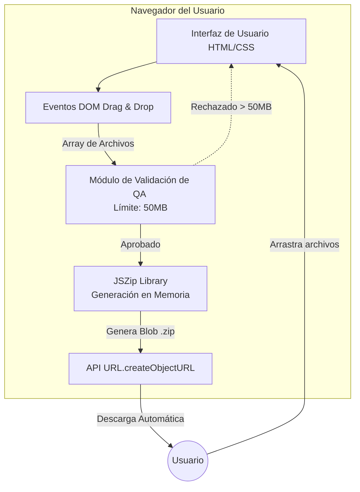

# 🏗️ Documento de Arquitectura: Proyecto "Comprimir Archivos"

## 1. Visión General de la Arquitectura

El sistema "Comprimir Archivos" se diseña bajo una arquitectura **Client-Side SPA (Single Page Application)**. Dado que la premisa es el empaquetado de documentos mediante `JSZip` directamente en el navegador, se prescinde de un servidor backend tradicional para el procesamiento de archivos. Esto garantiza una latencia cero en la subida/bajada de datos, reduce costos de infraestructura a cero y maximiza la privacidad del usuario.

## 2. Stack Tecnológico

- **Frontend / UI:** HTML5, CSS3 (Custom Properties, sin frameworks pesados para mantener el bundle ligero), JavaScript (ES6+).
- **Librería Core:** `JSZip` (v3.10.1) para la manipulación y generación de archivos `.zip` en memoria (Blob/ArrayBuffer).
- **DevOps / Entorno Local (Opcional):** Node.js con Express para servir estáticos en desarrollo local, evitando problemas de políticas CORS al cargar módulos locales.
- **Control de Versiones:** Git con flujo de trabajo Trunk-Based Development (ideal para equipos pequeños o desarrolladores individuales en proyectos muy acotados).

## 3. Diagrama de Arquitectura (Mermaid)

